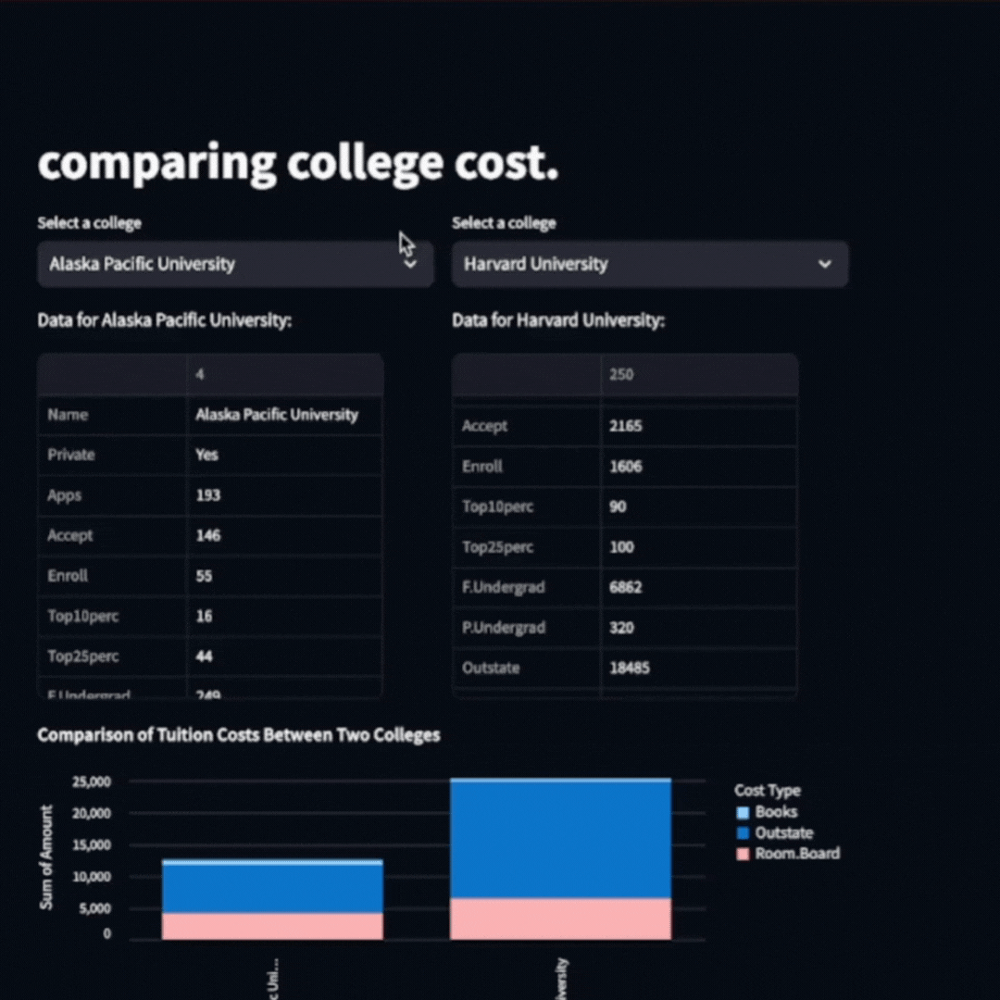

# DashDive

Deep dive into dashboard creation including all the data analysis required in the background.

Using [Introduction to Statistical Learning with Python](https://github.com/neshi47/Introduction-to-Statistical-Learning-with-Python) as a jumpoff point for some of these projects. 

## progress

### College cost comparison dash

Side by side comparison of tuition components from various colleges. 

[Try it here](https://comparecollegetuition.streamlit.app/)

